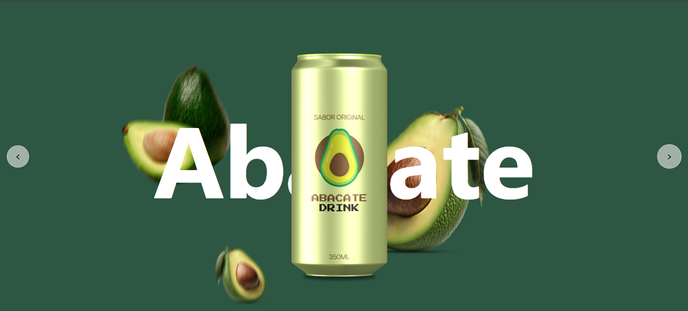

# 🥤 Apresentação de Refrigerantes

Projeto desenvolvido com **HTML, CSS e JavaScript** que simula uma apresentação interativa de produtos (refrigerantes).

A interface permite navegar entre diferentes sabores utilizando setas posicionadas nas extremidades da tela. Ao clicar nas setas, a lata exibida é alterada dinamicamente junto com seu respectivo sabor.

---

## 📸 Preview do Projeto

<p align="center">
  
</p>

---

## 🚀 Funcionalidades

- Exibição centralizada da lata de refrigerante
- Alteração dinâmica do sabor ao clicar nas setas laterais
- Transição visual entre os produtos
- Manipulação do DOM com JavaScript

---

## 📂 Estrutura do Projeto

```bash
📁 apresentacao_de_refrigerantes/
│
│── assets/
├── docs/
    └── preview.png
├── index.html
├── LICENCE
│── README.md/
├── script.js
├── style.css

```

---

## 💻 Como Clonar e Executar o Projeto

### 1️⃣ Clonar o Repositório

Abra o terminal e execute:

```bash
git clone https://github.com/thevinisantos/apresentacao_de_refrigerantes.git
```

### 2️⃣ Acessar a Pasta do Projeto

Acessar pasta do projeto:

```bash
cd apresentacao_de_refrigerantes
```

### 3️⃣ Executar o projeto

Como o projeto é feito apenas com HTML, CSS e JavaScript, não é necessário instalar dependências.

---

## 📄 Licença

Este projeto está sob a licença MIT.  
Consulte o arquivo [LICENSE](LICENSE) para mais informações.
